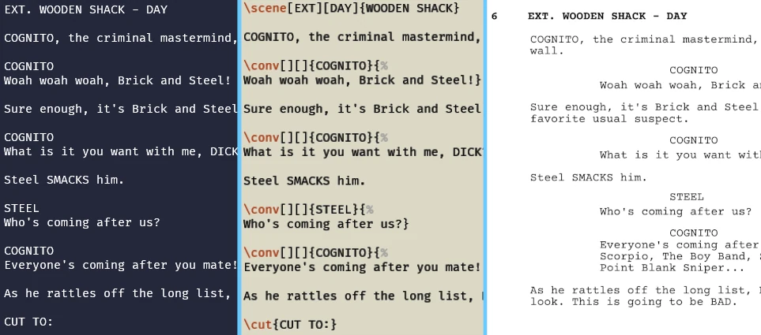

<h1 align="center">
    <br>
    
    <br>
    Bubbler
    <br>
</h1>

<h4 align="center">A LuaLaTeX-friendly alternative to [Fountain](https://fountain.io/), the screenwriting language.</h4>

<!-- <p align="center">
    
</p> -->

<p align="center">
    <a href="#installation">Installation</a> |
    <a href="#how-to-use">How To Use</a> |
    <a href="#faq">FAQ</a>
</p>

<a href="Brick-Steel/Brick-Steel.pdf"></a>

## Installation

1. Download the [newest release](https://github.com/atedifor/bubbler/releases/latest).
2. Put the `bubbler.lua` and `bubbler.cls` with any font (`*.ttf`) files in the same directory as your main (`*.tex`) file.
3. Follow the [instructions](#how-to-use) below and run with `LuaLaTeX`.
4. Share and Enjoy!

## How To Use

> Alternatively, you can read it in a "fun" form of a script [here](Example-Script/Example-Script.pdf).

### Document Template

```tex
\documentclass{bubbler}

% PREAMBLE

\begin{document}
\begin{script}

% CONTENT NOT TO BE RE-EMBEDDED

\contop

% MAIN CONTENT

\end{script}
\end{document}
```

### Preamble Settings

- `\skiptitle` - disable title page
- `\noscenenumber` - disable scene numbering
- `\noboldscene` - disable bold scene titles
- `\oscarstyle` - make script Oscar-compliant

### Title Page

- `\renewcommand{<bubbler-space>}{<text>}` - replace `<bubbler-space>` with `<text>`
    - Currently supported:
        - `\bubblertitle`
        - `\bubblercredit`
        - `\bubblerauthor`
        - `\bubblersource`
        - `\bubblernotes`
        - `\bubblerdraftdate`
        - `\bubblerdate`
        - `\bubblercontact`
        - `\bubblercopyright`
        - `\bubblerrevision`
        - `\bubblerheader`
        - `\bubblerfooter`
- `\titlehelp` - replace all `<bubler-space>` items with their respective names

### Formatting

- `\bol{<text>}` - make `<text>` bold
- `\ita{<text>}` - change `<text>` to italics
- `\bolita{<text>}` - change `<text>` to bold italics
- `\uli{<text>}` - underline `<text>`
- `\encen{<text>}` - center `<text>`

### Page Format/Contents

- `\contop` - alias for `\clearpage`, used by `\upbubble` to determine start of embeddable script
- `\unbubskip` - set `\parskip` to `0pt`
- `\rebubskip` - reset `\parskip`
- `\br` - alias for `\par` to be used in (supported) macros
- `\joinup{<paragraph>[\br<paragraph>]}` - join this macro's paragraph with the one above
    - Example:
      ```tex
      This is a paragraph I wrote.

      \joinup{%
      Here is another paragraph that I'd like to join with the one above.\br
      And one more.}
      ```
- `\seg{<name>}` - create a segment called `<name>`
    - renders as centered and bold
- `\cseg{<name>}` - similar to `\seg` but prefixed with `\clearpage`

### Script Writing

- `\begin[<character-limit>][<scene-limit>][<scene-categories>]{script}` - optional arguments serve as options for the *print-stats* function
    - appears somewhere around the end of `LuaLaTeX` output if enabled
    - `<character-limit>` / `<scene-limit>` - set number of top characters to print out, `0` to disable, `-1` to print all
    - `<scene-categories>` - `0` to turn off, `1` to turn on, `-1` to disable all statistics (default)
- `\scene[<int-ext>][<daytime>]{<name>}` - print out a scene
    - Format:
      `[<intext>. ]<name>[ - <daytime>]`
    - example - `\scene[INT][DAWN]{CHARLIE'S HOME}`
- `\conv[<type>][<method>]{<name>}{<text>}` - print out a character's speech
    - Format:
      ```
          <name> [(<type>)]
        [(<method>)]
      <text>
      ```
    - example - `\conv[O.S.][whispering]{CHARLIE}{We need to be very careful.}`
      (where O.S. stands for off-screen)
- `\diaconv[<type>][<method>]{<name>}{<text>}` - similar to `\conv` but take half of assigned space, to be used with `\dia`
- `\dia{<diaconv-left>}{<diaconv-right>}` - make two character speeches that occur simultaneously, replace `<diaconv-*>` with correcly formatted `\diaconv` (see above)
- `\inconv{<action>}` - make an action inside a character's speech, to be used in `\conv` or `\diaconv`
    - Format:
        ```
        ...
          (<action>)
        ...
        ```
    - example - `\inconv{pause}`
- `\cut{<type>}` - make a cut, right-aligned, no special formatting
    - example - `\cut{FADE TO:}`
- `\lyric{<text>}` - format `<text>` as sung, for now an alias for `\ita`
- `\music{<name>}` - attach `<name>` to `\scene` above it

### Tools
*Optional instances of `\clearpage` below can be forced by using a single period (`.`) as the optional `<title>`.*

- `\upbubble[<title>]{<tex-file>}` - embed another `<tex-file>` inside the current one, optionally prefixed with `\clearpage` and `<title>`
- `\rebubble[<title>]{<fountain-file>}` - convert `<fountain-file>` to Bubbler and embed output, optionally prefixed with `\clearpage` and `<title>`
    - Alternatively, directly with Lua:
      `bubbler.lua <source-fountain> <destination-tex>` (`bubbler.lua foo.fountain bar.tex`, i.e. `foo.fountain` to `bar.tex`)
      `bubbler.lua <source-destination>` (`bubbler.lua foo`, i.e. `foo.founatin` to `foo.tex`)
- `\clearmem` - reset character context for `\dumpmem`
- `\dumpmem[<title>]` - print out list of characters in current character context (since start of script or since last `\clearmem`), optionally prefixed with `\clearpage` and `<title>`

### External Packages

- All icons from the [ccicons](https://ctan.org/pkg/ccicons) package are supported.
- The `\begin{comment}` environment from [comment](https://ctan.org/pkg/comment) is supported.

## FAQ

### I need the script to fit the guidelines for the Oscars, is there any way to do this?

**Yes**, it's as simple as putting `\oscarstyle` in your preamble to turn off scene numbering and bold scene titles.

### Can I keep on using Fountain and use Bubbler to just convert it to TeX and, in turn, to PDF?

**Yes**, you fully may, although it might not be the best idea and might even rob you of some of the more advanced (and fun) features. TeX is much more formatting-extensible than Fountain and the rebubble (converter) function in Bubbler is quite simple, so some formatting might get lost (even though the loss should be minimal) if you stay in Fountain.

## Credits

> I'd like to thank [RNDr. Petr Olšák](https://petr.olsak.net/) for his support and for all the knowledge he shared during his wonderful course.

### Icon

- [Boba icon](https://game-icons.net/1x1/caro-asercion/boba.html) by [Caro Asercion](https://game-icons.net/) under [CC BY 3.0](http://creativecommons.org/licenses/by/3.0/)

### Inspiration

- [Fountain](https://fountain.io/)
- [Better Fountain](https://github.com/piersdeseilligny/betterfountain)

